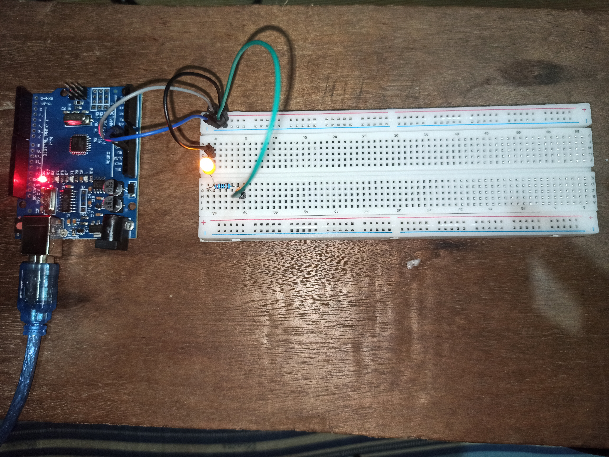
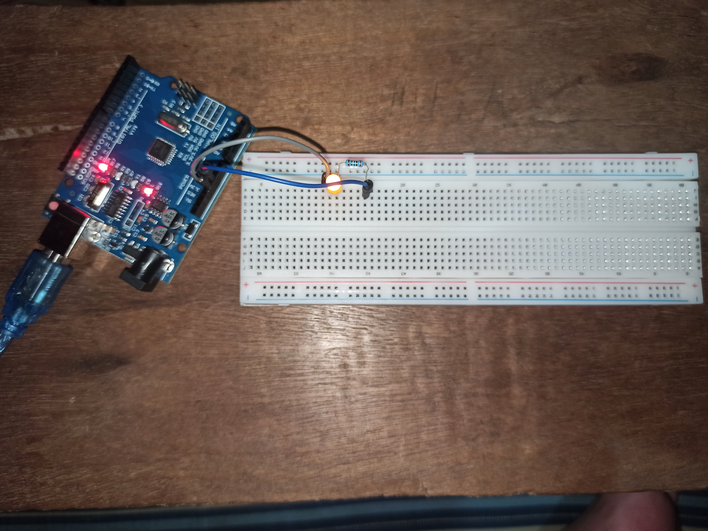

9/12/13
# My First Arduino project

*(Single yellow LED light)*

Kinda nervous 'cuz it's my first time trying arduino but it's so satisfying when it lit up.

## Components used:
- LED
- Breadboard
- Jumper wires
- Arduino
- Resistor
- USB cable

## Version 1 - Messy wiring (Intentional)

*Ver. 1 - Initial build - functional but messy wiring to test*

## Version 2 - Cleaner version

*Ver. 2 - Improved wire management*

## Things i learned:
**Law of breadboard:**
- Red line = 5V
- Blue line = GND
  
**Is A0 and A60 connected?**
No. 
  
The logic is like this: A0-E0 and F0-J0; A1-E1 and F1-J1; and so on

